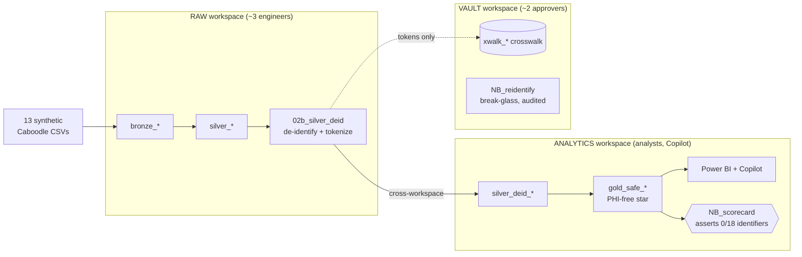

# Fabric PHI De-Identification & Tokenization Accelerator

[](https://github.com/rasgiza/fabric-phi-deidentification-accelerator/actions/workflows/ci.yml)
[](https://github.com/rasgiza/fabric-phi-deidentification-accelerator/actions/workflows/codeql.yml)
[](https://github.com/rasgiza/fabric-phi-deidentification-accelerator/releases)
[](LICENSE)


> ⚠️ **SYNTHETIC DATA ONLY.** This accelerator is a **reference / blueprint pattern**
> designed and demonstrated on **synthetic** Epic-Caboodle data (generated with Tonic
> Fabricate). It is **NOT a certified de-identification service.** Productionizing on
> real PHI requires your own Safe Harbor / Expert Determination validation, a signed
> Business Associate Agreement (BAA), and a security review. See
> [docs/positioning_and_scope.md](docs/positioning_and_scope.md).

A two-tier solution accelerator for Microsoft Fabric that shows how to **classify,
control access to, and physically de-identify** Protected Health Information (PHI) on a
Lakehouse medallion (Bronze → Silver → Gold), so that the Gold layer that Power BI and
Copilot point at contains **no PHI by construction**.

### 👉 New here? Start with the **[QUICKSTART](QUICKSTART.md)** — 6 steps to a PHI-free Gold layer.

## What you'll build



The Gold layer that Power BI and Copilot read contains **no PHI by construction** —
`NB_scorecard` proves it by asserting **0 of the 18 HIPAA Safe Harbor identifiers** survive.

## Prerequisites

- A **Microsoft Fabric** capacity (Trial capacity works) with permission to create workspaces.
- The **Data Engineering** experience enabled.
- Python 3.11+ locally to run the tests or the sample-data generator (optional — the notebooks run in Fabric).
- *(Production path only)* An Azure subscription for Key Vault. **Not** needed for the synthetic demo.

> **Positioning (new customers):** lead with **Microsoft Fabric as Microsoft's primary data
> governance solution**, and the **OneLake catalog as its unified governance foundation** — a
> single place to **discover, manage, and govern** data across **multi-cloud and hybrid**
> environments. This accelerator sits on top of that foundation: Tier 0 *is* the
> OneLake-catalog starting point, and Tier 3 (PHI de-identification) is the capstone it
> unlocks. See [docs/positioning_and_scope.md](docs/positioning_and_scope.md).

## Why this exists

Microsoft Fabric **secures and governs** PHI (Purview classifies/labels/monitors; OneLake
security enforces who can read which bytes) — but **nothing native in Fabric _transforms_
PHI**. De-identification is the missing layer. This accelerator is that layer, built from
Microsoft-native building blocks (Spark + Azure Key Vault), running entirely **in-tenant**
(no data leaves Fabric).

Once the [18 HIPAA Safe Harbor identifiers](docs/safe_harbor_mapping.md) are removed or
tokenized, the data is **no longer PHI** — so it can flow to analytics, self-service
reporting, and AI **without** BAA constraints.

## The two tiers

| Tier | Name | Audience | Consumable |
|------|------|----------|------------|
| **Tier 0** | [Catalog Enablement & Classification](tier0/README.md) | Business users, data stewards, security (EIS) | Now — mostly UI + automation scripts |
| **Tier 3** | PHI De-ID & Tokenization (this engine) | Data engineers, compliance, ML | Reference pattern on synthetic data |

**The bridge:** the PHI/PII classification you apply in Tier 0 (sensitivity labels on
columns) becomes the input rulebook ([`config/deid_rules.yaml`](config/deid_rules.yaml))
that drives the Tier 3 de-identification engine. *The classification you do in the catalog
today becomes the rulebook that de-identifies your data tomorrow.*

## Repository layout

```
fabric-phi-deid-accelerator/
  README.md                     ← you are here
  pyproject.toml                ← installable package (hatchling), lint/type/test/security config
  config/
    deid_rules.yaml             ← per-column strategy config (safe_harbor + expert_determination)
  src/fabric_phi_deid/          ← installable Python package (pip install -e ".[dev]")
    tokenization.py             ← HMAC-SHA256 deterministic tokenizer (pure fn, Key Vault pepper)
    deid_engine.py              ← strategy dispatcher (pure core + lazy Spark wrappers)
    config.py                   ← config schema validation + coverage linter (fail-fast on drift)
    audit.py                    ← PHI-free run manifests + config fingerprint + audit logger
    validation.py               ← residual-PHI regex scanners (SSN / phone / email)
  notebooks/
    01_bronze_ingest.ipynb      ← foundation: 13 CSVs → typed bronze_* Delta
    02_silver_conform.ipynb     ← foundation: current rows, derived cols, referential integrity
    02b_silver_deid.ipynb       ← de-identify + tokenize → silver_deid_*
    03_gold_star.ipynb          ← foundation: star schema (the "before" — PHI reaches Gold)
    03b_gold_safe.ipynb         ← PHI-free star schema → gold_safe_*
    NB_reidentify.ipynb         ← RESTRICTED: token → original value (Vault workspace, ~2 people)
    NB_scorecard.ipynb          ← compliance: assert 0/18 identifiers survive into gold_safe_*
  sql/
    rls_cls_policies.sql        ← OneLake / Warehouse RLS + CLS (defense-in-depth demo)
  reports/
    Gold Safe Analytics.SemanticModel/  ← committed Direct Lake model over gold_safe_* (TMDL)
    After PHI Deidentified.pbip         ← safe report (byPath to the model — self-contained)
    Before PHI Exposed.pbip / PHI Toggle Demo.pbip  ← unsafe "before" baseline (rebind to your gold_*)
    README.md                   ← rebind steps + which names are examples
  tier0/
    README.md                   ← catalog onboarding runbook + classification taxonomy
    inventory_catalog.py        ← Catalog Search API → data inventory
  docs/
    positioning_and_scope.md    ← maturity ladder + "not a certified service" boundary
    enforcement_models.md       ← transform-at-rest vs mask-at-query; where Purview stops
    security_model.md           ← 3-workspace isolation, planes, EIS security one-pager
    hipaa_compliance.md         ← shared-responsibility; is Fabric HIPAA compliant?
    safe_harbor_mapping.md      ← 18 identifiers → columns → strategy
    market_landscape.md         ← build vs buy; Tonic (Azure Marketplace), Immuta, Presidio
    demo_runbook.md             ← 5-act demo with 1 admin + 2 user accounts
    pepper_rotation_runbook.md  ← generate / store / rotate the Key Vault pepper
    pre_real_phi_checklist.md   ← the gates that must be signed off BEFORE any real PHI
  tests/                        ← core, config-validation, audit, residual-PHI, property, Spark
  .github/workflows/ci.yml      ← lint + type + test (3.11/3.12) + security (bandit/pip-audit/gitleaks)
  SECURITY.md  CONTRIBUTING.md  CHANGELOG.md  CODEOWNERS  LICENSE
```

## Quickstart (local — logic only)

```powershell
python -m pip install -e ".[dev]"
pytest -q            # 50 unit/config/audit/property tests; Spark tests auto-skip without pyspark
```

To run the optional Spark integration tests locally, also install the extra:

```powershell
python -m pip install -e ".[dev,spark]"
pytest -q            # now includes the end-to-end PySpark tests
```

The full CI gate (matching `.github/workflows/ci.yml`) is:

```powershell
ruff check . ; ruff format --check . ; mypy ; pytest -q ; bandit -r src -ll
```


## Quickstart (Fabric)

> **The notebooks do NOT all go in one workspace.** This accelerator's primary security
> control is **physical isolation across three workspaces**, not masking — because anyone
> with an Admin/Member/**Contributor** role on a workspace *bypasses* OneLake security, RLS,
> and CLS. Masking can be seen through; removing the PHI bytes to a separate workspace cannot.
> See [docs/security_model.md](docs/security_model.md) for the full rationale.

**Workspace layout — which notebook lives where:**

| Workspace | Notebooks | Tables | Access |
|-----------|-----------|--------|--------|
| **Raw (PHI)** | `01_bronze_ingest`, `02_silver_conform`, `02b_silver_deid` *(the one privileged crossing point)* | `bronze_*`, `silver_*` (raw PHI) | ~3 engineers |
| **Analytics** | `03b_gold_safe_analytics`, `NB_scorecard` | `silver_deid_*`, `gold_safe_*`, model, reports | Analysts, business, Copilot |
| **Vault** | `NB_reidentify` | `xwalk_*` crosswalk | ~2 approvers (break-glass, audited) |

`02b_silver_deid` runs **in Raw** (it reads raw PHI and writes de-identified output — the only
notebook that touches both). `03b_gold_safe_analytics` runs **in Analytics** and reads `02b`'s
output *cross-workspace*, so exactly one physical, PHI-free copy lands in Analytics.

**Setup steps:**

1. Create the **three workspaces** (Raw, Analytics, Vault) and grant each the minimal audience
   above. Attach a Lakehouse in each.
2. Land the 13 synthetic Caboodle CSVs at `Files/raw/caboodle_provider/` in the **Raw** workspace.
   They are **bundled in this repo** under
   [`sample_data/caboodle_provider/`](sample_data/caboodle_provider/) (synthetic, generated with
   Tonic Fabricate — no real PHI) so you can run the pipeline immediately; just upload that folder
   to the Raw Lakehouse. Need more volume for load/variety? Append FK-safe synthetic rows with
   [`scripts/generate_sample_data.py`](scripts/generate_sample_data.py), e.g.
   `python scripts/generate_sample_data.py --add-claims 100000 --add-patients 5000 --seed 42`.
3. Import each notebook into its workspace per the table above (Data Engineering → Import) and
   upload `src/` + `config/` to that workspace's Lakehouse at `Files/accelerator/`.
4. Provide the tokenization **pepper**:
   - **Synthetic demo (Option 2):** set the `PHI_DEID_PEPPER` env var — no Azure setup needed.
   - **Production (Option 1):** run
     [`scripts/provision_keyvault.ps1`](scripts/provision_keyvault.ps1) /
     [`scripts/provision_keyvault.sh`](scripts/provision_keyvault.sh) to create the vault,
     store the secret (default name `phi-deid-pepper`), and grant the runtime identity read
     access; then set `PHI_DEID_KEYVAULT_URL` to your vault URL. `get_pepper()` reads it at
     runtime and never falls back to a hardcoded value. See
     [docs/security_model.md](docs/security_model.md) and
     [docs/pepper_rotation_runbook.md](docs/pepper_rotation_runbook.md); never hardcode it.
5. Run in order — **Raw:** `01` → `02` → `02b`; **Analytics:** `03b` → `NB_scorecard`;
   **Vault:** `NB_reidentify` only when a governed re-identification is approved.
6. For the security demo, apply [`sql/rls_cls_policies.sql`](sql/rls_cls_policies.sql) and
   follow [docs/demo_runbook.md](docs/demo_runbook.md).
7. **(Optional) Open the Power BI report.** A thin report + committed Direct Lake semantic
   model ship in [`reports/`](reports/README.md). Open `After PHI Deidentified.pbip` in Power
   BI Desktop and make the one required edit — point the model at your Analytics Lakehouse SQL
   endpoint (replace the `REPLACE_WITH_YOUR_SQL_ENDPOINT` placeholder). Workspace/Lakehouse
   names in the shipped files are examples. See [reports/README.md](reports/README.md).

## Cleanup

Delete the three Fabric workspaces (Raw, Analytics, Vault) — this removes their Lakehouses and
all `bronze_*`, `silver_*`, `silver_deid_*`, `gold_safe_*`, and `xwalk_*` tables in one step.
If you followed the **production** pepper path, also delete the Azure Key Vault / resource
group provisioned by [`scripts/provision_keyvault.ps1`](scripts/provision_keyvault.ps1). No
other Azure resources are created by the synthetic demo.

## Compliance boundary

This accelerator demonstrates a pattern. It does **not** constitute HIPAA compliance,
legal advice, or a de-identification certification. The **SYNTHETIC-ONLY** guardrail stays
in place until every gate in
[docs/pre_real_phi_checklist.md](docs/pre_real_phi_checklist.md) is signed off. See also
[docs/hipaa_compliance.md](docs/hipaa_compliance.md) and
[docs/positioning_and_scope.md](docs/positioning_and_scope.md).
