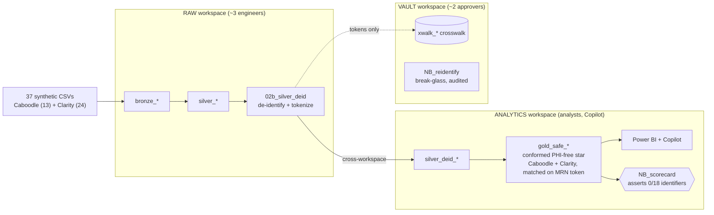

# Fabric PHI De-Identification & Tokenization Accelerator

[](https://github.com/rasgiza/fabric-phi-deidentification-accelerator/actions/workflows/ci.yml)
[](https://github.com/rasgiza/fabric-phi-deidentification-accelerator/actions/workflows/codeql.yml)
[](https://github.com/rasgiza/fabric-phi-deidentification-accelerator/releases)
[](LICENSE)


> ⚠️ **SYNTHETIC DATA ONLY.** This accelerator is a **reference / blueprint pattern**
> designed and demonstrated on **synthetic** Epic-shaped data — both a **Caboodle**
> dimensional warehouse and a **Clarity** normalized transactional schema. It is
> **NOT a certified de-identification service.** Productionizing on
> real PHI requires your own Safe Harbor / Expert Determination validation, a signed
> Business Associate Agreement (BAA), and a security review. See
> [docs/positioning_and_scope.md](docs/positioning_and_scope.md).

A two-tier solution accelerator for Microsoft Fabric that shows how to **classify,
control access to, and physically de-identify** Protected Health Information (PHI) on a
Lakehouse medallion (Bronze → Silver → Gold), so that the Gold layer that Power BI and
Copilot point at contains **no PHI by construction**.

### 👉 New here? Start with the **[QUICKSTART](QUICKSTART.md)** — 6 steps to a PHI-free Gold layer.

> ⚡ **Want it stood up automatically?** Create one workspace, import
> **[`PHI_Deid_Launcher.ipynb`](PHI_Deid_Launcher.ipynb)** into it, and **Run All** — that
> workspace becomes Raw, and the launcher creates the other two workspaces + lakehouses, uploads
> the code/config/data, and imports the notebooks (auto-patched, no manual GUID edits). Manual
> setup stays fully supported.

## Table of contents

- [What you'll build](#what-youll-build)
  - [Auditing and evidence](#auditing-and-evidence)
- [Two source schemas, one engine](#two-source-schemas-one-engine)
- [Free-text PHI and detector quality](#free-text-phi-and-detector-quality)
- [Prerequisites](#prerequisites)
- [Why this exists](#why-this-exists)
- [The two tiers](#the-two-tiers)
- [De-identification strategies](#de-identification-strategies)
- [Repository layout](#repository-layout)
- [Quickstart (local)](#quickstart-local)
- [Quickstart (Fabric)](#quickstart-fabric)
- [Cleanup](#cleanup)
- [Compliance boundary](#compliance-boundary)

**Key docs:** [Quickstart](QUICKSTART.md) · [De-Identification Standard](docs/deidentification_standard.md) · [Security model](docs/security_model.md) · [Safe Harbor mapping](docs/safe_harbor_mapping.md) · [HIPAA compliance](docs/hipaa_compliance.md) · [Pre-real-PHI checklist](docs/pre_real_phi_checklist.md) · [Positioning & scope](docs/positioning_and_scope.md)

## What you'll build


```mermaid
flowchart LR
    CSV["37 synthetic CSVs<br/>Caboodle (13) + Clarity (24)"] --> B[bronze_*]
    subgraph RAW["RAW workspace (~3 engineers)"]
        B --> S[silver_*]
        S --> D[02b_silver_deid<br/>de-identify + tokenize]
    end
    subgraph ANALYTICS["ANALYTICS workspace (analysts, Copilot)"]
        D -->|cross-workspace| SD[silver_deid_*]
        SD --> G["gold_safe_*<br/>conformed PHI-free star<br/>Caboodle + Clarity, matched on MRN token"]
        G --> BI[Power BI + Copilot]
        SC{{NB_scorecard<br/>asserts 0/18 identifiers}}
    end
    subgraph VAULT["VAULT workspace (~2 approvers)"]
        XW[(xwalk_* crosswalk)]
        RE[NB_reidentify<br/>break-glass, audited]
    end
    D -.->|tokens only| XW
    G --> SC
```

The Gold layer that Power BI and Copilot read contains **no PHI by construction** —
`NB_scorecard` proves it by asserting that none of the **16 HIPAA identifiers that exist in
the bundled schemas** survive. The remaining two — (P) biometric identifiers and (Q) full-face
photographs — are reported as `NOT_EVALUATED`, because the pipeline reads structured Delta
tables and has no imaging path: a check that was never run is not a check that passed.

The scorecard also verifies **which HIPAA method you may claim**. The pipeline tokenizes MRNs
so the de-identified Caboodle and Clarity stars can still join, and an HMAC of an MRN is a
value derived from the individual — permitted under **Expert Determination** (HHS §2.9) but not
under Safe Harbor's re-identification-code exception (§164.514(c)(1)). The gate compares the
claimed method against what the rulebook actually does and fails the run on a mismatch.

### Auditing and evidence

Every run is auditable — the accelerator does not just transform data, it **produces proof**:

- **Direct-identifier gates (hard fail):** no SSN / phone / email patterns, MRN fully
  tokenized, no raw date-of-birth, ZIP ≤ 3 digits. Any failure raises and blocks Gold.
- **Residual re-identification risk (hard fail, waivable):** `NB_scorecard` measures
  **k-anonymity, l-diversity, and t-closeness** over the quasi-identifier set
  (`BirthYear, Gender, Race, ZIP`) via [`privacy_metrics.py`](src/fabric_phi_deid/privacy_metrics.py)
  and **blocks the run** if a threshold is missed. Re-identification risk is the thing this
  accelerator exists to manage, so it is not left as a statistic you can ignore.
  A failing gate has exactly two outcomes: **fix it** (generalize further, or suppress the
  residual tail with `suppress_quasi_identifiers_spark`) or **sign for it** — record a
  `accepted_risk` block in [`deid_rules.yaml`](config/deid_rules.yaml) naming a person, a
  scope, and an expiry date. A waived run reports `PASSED_WITH_ACCEPTED_RISK`, never `PASSED`,
  and prints the signer in the evidence artifact. An expired, blank, or placeholder acceptance
  fails closed.
  > The **shipped demo ships waived** (`accepted_by: "UNSIGNED"`), because k=1 is arithmetically
  > unavoidable when you publish birth year and 3-digit ZIP at patient grain. That is the point:
  > you see the real number, and you see that someone has to own it.
- **Determination governance:** the de-id method, reviewer, and review-by (expiry) date are
  recorded, so an expired Expert Determination is flagged before real PHI is processed.
- **PHI-free evidence artifact:** each run writes a metadata-only
  `scorecard_<id>.json` to `Files/audit/` (thresholds, checks, verdicts, determination —
  **no data values**), plus a per-run manifest and config fingerprint from
  [`audit.py`](src/fabric_phi_deid/audit.py). These are safe to keep as a compliance trail.

## Two source schemas, one engine

The usual objection to a de-identification demo is "that only works because it was built
for *your* tables." So the accelerator ships **two** synthetic Epic-shaped sources with
deliberately different shapes, and de-identifies both with the **same engine and the same
notebook**:

| | **Caboodle** | **Clarity** |
|---|---|---|
| Shape | Dimensional warehouse | Normalized transactional |
| Tables | 13 (`dim_*`, `fact_*`, `bridge_*`) | 24 (`clarity_*`, incl. 10 `ZC_*` code tables) |
| Grain | Conformed, one row per entity | Raw operational rows |
| Patient key | `PatientKey` surrogate + `MRN` | `PAT_ID` + `PAT_MRN_ID` |
| Bronze prefix | `bronze_` | `bronze_clarity_` |

**What actually changed to add the second schema:** a table→schema entry in
`01_bronze_ingest`'s `SOURCES` registry and a block of column rules in
[`config/deid_rules.yaml`](config/deid_rules.yaml). `02b_silver_deid` contains **no table
names at all** — it resolves whichever sources are present and applies the rulebook.
Onboarding a third EHR is a **config change, not a code change**.

Two details worth calling out, because they are judgement calls a generic tool gets wrong:

- **`PAT_ENC_CSN_ID` is tokenized, but Caboodle's `EncounterKey` is not.** A CSN is printed
  on discharge paperwork and shown in the UI, so it is a real-world identifier. A warehouse
  surrogate key that never leaves the database is not. Same concept, different risk.
- **MRN shares one token namespace across both schemas**, so a patient present in both
  systems resolves to the same `PT-…` token and reconciles downstream — the reason to use
  keyed HMAC tokens instead of random surrogates.
  [`tests/test_multi_source_rules.py`](tests/test_multi_source_rules.py) asserts this, plus
  profile parity and "Safe Harbor never emits a full date," so the rulebook cannot drift
  silently.

Gold (`03b`) conforms **both** schemas into one star. `gold_safe_dim_patient` is a genuinely
conformed dimension: the two sources are matched on the shared `mrn` token, so a patient in
both systems is **one row** tagged `SourceSystem = 'Both'`, and a Clarity-only patient gets a
`PatientKey` minted from that same token — so they keep their key if they later show up in
Caboodle. Clarity's orders and results have no Caboodle equivalent, so they land as
`gold_safe_fact_clarity_*` at their own grain and link back through the conformed
`PatientKey`; forcing them into `fact_encounter` would invent a grain neither source has.

The star's column projections live in
[`gold_conform.py`](src/fabric_phi_deid/gold_conform.py), not in the notebooks — so the
PHI-Raw and Analytics copies of `03b` cannot drift apart, and
[`tests/test_gold_conform.py`](tests/test_gold_conform.py) asserts the whole shape against the
rulebook **without a Spark session**: every published column is explicitly ruled, none is
suppressed (a suppressed column would publish as silent nulls), and both MRN columns still
share one token namespace. Loading only Caboodle is still supported — `03b` detects it and
builds the Caboodle-only star.

## Free-text PHI and detector quality

Structured columns are only half the problem — PHI also hides *inside* free-text (clinical
notes, reason-for-visit, comments). The accelerator detects and removes it, and is explicit
about **what it has and has not proven** about how well it does so:

- **Detection + redaction** — [`ner_text.py`](src/fabric_phi_deid/ner_text.py) uses
  **Microsoft Presidio** (NER for PERSON / LOCATION / DATE_TIME / SSN / phone / email /
  medical-license) when installed (`pip install 'fabric-phi-deid[nlp]'`), with a
  dependency-free **regex fallback** for structured identifiers. Redaction can label
  (`[PERSON]`), deterministically **tokenize** (linkage-preserving), or remove. Spark wrappers
  (`redact_text_column`, `scan_text_column`) run it at table scale. The sample pipeline
  exercises this for real: `FactEncounter.ReasonForVisitNote` carries synthetic clinical notes
  and is de-identified by the `redact_text` rule in
  [`deid_rules.yaml`](config/deid_rules.yaml) on every Silver run.
- **Structured-identifier coverage (a hard gate)** —
  [`eval_harness.py`](src/fabric_phi_deid/eval_harness.py) scores the detector against the
  **shipped synthetic labeled corpus** ([`eval_fixtures.py`](src/fabric_phi_deid/eval_fixtures.py))
  at value level (`evaluate_sets` / `evaluate_flags`) and span level (`evaluate_spans`,
  overlap-based). `NB_scorecard` **fails the run** if the detector misses any *structured*
  identifier — SSN, phone, email, card, IP, URL, MRN. These are exact-form patterns, so the
  regex backend either matches them or it is broken, and a miss is a defect rather than a
  model-quality question.
- **Recall is deliberately `NOT_EVALUATED`** — and the scorecard says so in writing. The
  shipped fixtures were authored alongside the detector, so scoring against them measures
  *self-consistency*, not recall; publishing that ratio as "recall" would overstate what is
  known. A defensible figure needs an external annotated corpus (i2b2 / n2c2), which is
  licensed and not redistributable. **If you need a recall number, benchmark it yourself on
  your own annotated notes** — see [`eval_harness.py`](src/fabric_phi_deid/eval_harness.py).

> Free-text detection is probabilistic. Treat a `[regex-fallback]` posture as
> **detection-incomplete**: it catches structured identifiers and *does not* catch contextual
> ones (names, places, dates). Install the `nlp` extra for real notes — and note that even then
> the accelerator reports no recall figure it has not earned.

> **When to use something else.** For **free-text- or LLM-prompt-only** redaction (scrub a
> document or an outbound LLM call), a dedicated text tool such as
> [Microsoft Presidio](https://github.com/data-privacy-stack/presidio) is the mature choice — and this
> accelerator *uses* Presidio under the hood rather than reinventing it. This project is for the
> problem those tools don't solve: **de-identifying structured PHI across a Fabric medallion
> lakehouse** (Bronze → Silver → Gold) in-tenant, with governance, physical de-id, and
> policy-linked evidence. Use both — Presidio for the text, this for the warehouse.

## Prerequisites

- A **Microsoft Fabric** capacity (Trial capacity works) with permission to create workspaces.
- The **Data Engineering** experience enabled.
- Python 3.11+ locally to run the tests or the sample-data generator (optional — the notebooks run in Fabric).
- *(Production path only)* An Azure subscription for Key Vault. **Not** needed for the synthetic demo.

> **Positioning (new customers):** lead with **Microsoft Fabric as Microsoft's primary data
> governance solution**, and the **OneLake catalog as its unified governance foundation** — a
> single place to **discover, manage, and govern** data across **multi-cloud and hybrid**
> environments. This accelerator sits on top of that foundation: Tier 0 *is* the
> OneLake-catalog starting point, and Tier 3 (PHI de-identification) is the capstone it
> unlocks. See [docs/positioning_and_scope.md](docs/positioning_and_scope.md).

## Why this exists

Microsoft Fabric **secures and governs** PHI (Purview classifies/labels/monitors; OneLake
security enforces who can read which bytes) — but **nothing native in Fabric _transforms_
PHI**. De-identification is the missing layer. This accelerator is that layer, built from
Microsoft-native building blocks (Spark + Azure Key Vault), running entirely **in-tenant**
(no data leaves Fabric).

Once the [18 HIPAA Safe Harbor identifiers](docs/safe_harbor_mapping.md) are removed or
tokenized, the data is **no longer PHI** — so it can flow to analytics, self-service
reporting, and AI **without** BAA constraints.

## The two tiers

| Tier | Name | Audience | Consumable |
|------|------|----------|------------|
| **Tier 0** | [Catalog Enablement & Classification](tier0/README.md) | Business users, data stewards, security (EIS) | Now — mostly UI + automation scripts |
| **Tier 3** | PHI De-ID & Tokenization (this engine) | Data engineers, compliance, ML | Reference pattern on synthetic data |

**The bridge:** the PHI/PII classification you apply in Tier 0 (sensitivity labels on
columns) becomes the input rulebook ([`config/deid_rules.yaml`](config/deid_rules.yaml))
that drives the Tier 3 de-identification engine. *The classification you do in the catalog
today becomes the rulebook that de-identifies your data tomorrow.*

## De-identification strategies

Every column gets exactly **one** strategy, chosen by whether it has analytic value and whether
you ever need to **link on it** or **recover it**. Full per-field mapping:
[docs/safe_harbor_mapping.md](docs/safe_harbor_mapping.md#strategy-glossary-which-treatment-each-field-gets-and-why).

| Strategy | What it does | Reversible? | Example fields |
|----------|--------------|-------------|----------------|
| **tokenize** | Deterministic HMAC token (same input → same token); keeps records joinable | **Yes** — governed re-id via Vault | `MRN`→`PT-`, `NPI`→`NP-`, `LicenseNumber`, `DEANumber` |
| **synthesize** | Replaces with **realistic fake data** (e.g. a fake name); not derived from the original | **No** — original discarded | `FirstName`, `LastName`, `PatientName`, provider names |
| **generalize** | Reduces precision: date → year, ZIP → 3-digit, age → cap 90 | No | `DateOfBirth`, `ZIP`, `Age`, `ServiceDate` |
| **date_shift** | *(Expert Determination)* per-patient date offset; **intervals preserved** | No | dates (ED profile) |
| **suppress** | Drops the value — **the default** for any unlisted column (deny-by-default) | No | `AddressLine1`, `ServiceMonth`, unlisted columns |
| **passthrough** | Keeps non-identifying values unchanged | n/a | `PatientKey`, `Gender`, `Race`, measures |
| **redact_text** | Detects + removes identifiers **inside** free text | Depends on mode | clinical notes (`ner_text`) |

> **A fake name is `synthesize`, not tokenization.** Synthesizing is **irreversible** fake data
> with no link back to the person (used for names). **Tokenization** is a **deterministic,
> governed-reversible** stand-in for IDs you must join on or re-identify (MRN, NPI). Rule of
> thumb: *need to link or recover it?* → `tokenize`; *direct identifier you never need again?* →
> `synthesize` (names) / `suppress` (addresses); *useful but too precise?* → `generalize`.

## Repository layout

```
fabric-phi-deid-accelerator/
  README.md                     ← you are here
  pyproject.toml                ← installable package (hatchling), lint/type/test/security config
  config/
    deid_rules.yaml             ← per-column strategy config (safe_harbor + expert_determination)
  src/fabric_phi_deid/          ← installable Python package (pip install -e ".[dev]")
    tokenization.py             ← HMAC-SHA256 deterministic tokenizer (pure fn, Key Vault pepper)
    deid_engine.py              ← strategy dispatcher (pure core + lazy Spark wrappers)
    config.py                   ← config schema validation + coverage linter (fail-fast on drift)
    audit.py                    ← PHI-free run manifests + config fingerprint + audit logger
    validation.py               ← residual-PHI regex scanners (SSN / phone / email)
    privacy_metrics.py          ← residual re-id risk: k-anonymity / l-diversity / t-closeness (+ Spark)
    ner_text.py                 ← free-text PHI detection + redaction (Presidio NER, regex fallback, Spark)
    eval_harness.py             ← detector quality: precision / recall / F1 (value + span level)
    eval_fixtures.py            ← shipped synthetic labeled corpus (measures free-text recall)
  notebooks/
    01_bronze_ingest.ipynb      ← foundation: 37 CSVs (2 source schemas) → typed bronze_* Delta
    02_silver_conform.ipynb     ← foundation: current rows, derived cols, referential integrity
    02b_silver_deid.ipynb       ← de-identify + tokenize → silver_deid_*
    03_gold_star.ipynb          ← foundation: star schema (the "before" — PHI reaches Gold)
    03b_gold_safe.ipynb         ← PHI-free star schema → gold_safe_*
    NB_reidentify.ipynb         ← RESTRICTED: token → original value (Vault workspace, ~2 people)
    NB_scorecard.ipynb          ← compliance: 0/18 identifiers + k-anon/l-div/t-closeness + evidence JSON
    NB_cleanup_gold.ipynb       ← housekeeping: drops gold_safe_* tables the config no longer declares
  sql/
    rls_cls_policies.sql        ← OneLake / Warehouse RLS + CLS (defense-in-depth demo)
  reports/
    Gold Safe Analytics.SemanticModel/  ← committed Direct Lake model over all 17 gold_safe_* tables (TMDL)
    After PHI Deidentified.pbip         ← safe report (byPath to the model — self-contained)
    Before PHI Exposed.pbip / PHI Toggle Demo.pbip  ← unsafe "before" baseline (rebind to your gold_*)
    README.md                   ← rebind steps + which names are examples
  tier0/
    README.md                   ← catalog onboarding runbook + classification taxonomy
    inventory_catalog.py        ← Catalog Search API → data inventory
  docs/
    positioning_and_scope.md    ← maturity ladder + "not a certified service" boundary
    deidentification_standard.md ← controlled policy template (10 sections) + control→Fabric crosswalk
    enforcement_models.md       ← transform-at-rest vs mask-at-query; where Purview stops
    security_model.md           ← 3-workspace isolation, planes, EIS security one-pager
    hipaa_compliance.md         ← shared-responsibility; is Fabric HIPAA compliant?
    safe_harbor_mapping.md      ← 18 identifiers → columns → strategy
    market_landscape.md         ← build vs buy; Tonic (Azure Marketplace), Immuta, Presidio
    demo_runbook.md             ← 5-act demo with 1 admin + 2 user accounts
    pepper_rotation_runbook.md  ← generate / store / rotate the Key Vault pepper
    pre_real_phi_checklist.md   ← the gates that must be signed off BEFORE any real PHI
  tests/                        ← core, config-validation, audit, residual-PHI, property, Spark, semantic-model drift
  scripts/
    link_clarity_to_caboodle.py           ← give the two synthetic extracts a shared patient cohort
    generate_clarity_semantic_tables.py   ← render the Clarity half of the semantic model from gold_conform
  .github/workflows/ci.yml      ← lint + type + test (3.11/3.12) + security (bandit/pip-audit/gitleaks)
  SECURITY.md  CONTRIBUTING.md  CHANGELOG.md  CODEOWNERS  LICENSE
```

## Quickstart (local)

```powershell
python -m pip install -e ".[dev]"
pytest -q            # 50 unit/config/audit/property tests; Spark tests auto-skip without pyspark
```

To run the optional Spark integration tests locally, also install the extra:

```powershell
python -m pip install -e ".[dev,spark]"
pytest -q            # now includes the end-to-end PySpark tests
```

The full CI gate (matching `.github/workflows/ci.yml`) is:

```powershell
ruff check . ; ruff format --check . ; mypy ; pytest -q ; bandit -r src -ll
```


## Quickstart (Fabric)

> **The notebooks do NOT all go in one workspace.** This accelerator's primary security
> control is **physical isolation across three workspaces**, not masking — because anyone
> with an Admin/Member/**Contributor** role on a workspace *bypasses* OneLake security, RLS,
> and CLS. Masking can be seen through; removing the PHI bytes to a separate workspace cannot.
> See [docs/security_model.md](docs/security_model.md) for the full rationale.

**Workspace layout — which notebook lives where:**

| Workspace | Notebooks | Tables | Access |
|-----------|-----------|--------|--------|
| **Raw (PHI)** | `01_bronze_ingest`, `02_silver_conform`, `02b_silver_deid` *(the one privileged crossing point)* | `bronze_*`, `silver_*` (raw PHI) | ~3 engineers |
| **Analytics** | `03b_gold_safe_analytics`, `NB_scorecard` | `silver_deid_*`, `gold_safe_*`, model, reports | Analysts, business, Copilot |
| **Vault** | `NB_reidentify` | `xwalk_*` crosswalk | ~2 approvers (break-glass, audited) |

`02b_silver_deid` runs **in Raw** (it reads raw PHI and writes de-identified output — the only
notebook that touches both). `03b_gold_safe_analytics` runs **in Analytics** and reads `02b`'s
output *cross-workspace*, so exactly one physical, PHI-free copy lands in Analytics.

**Setup steps:**

1. Create the **three workspaces** (Raw, Analytics, Vault) and grant each the minimal audience
   above. Attach a Lakehouse in each.
2. Land the synthetic source CSVs in the **Raw** workspace's Lakehouse. Both datasets are
   **bundled in this repo** (synthetic — no real PHI), and each is independent: upload one
   or both and the pipeline adapts.

   | Bundled folder | Upload to | Tables |
   |---|---|---|
   | [`sample_data/caboodle_provider/`](sample_data/caboodle_provider/) | `Files/raw/caboodle_provider/` | 13 |
   | [`sample_data/Clarity/`](sample_data/Clarity/) | `Files/raw/clarity/` | 24 |

   The destination folder names are a **contract** with `01_bronze_ingest` — rename one and
   you get a silently empty ingest, not an error. Need more volume for load/variety? Append
   FK-safe synthetic rows to the Caboodle set with
   [`scripts/generate_sample_data.py`](scripts/generate_sample_data.py), e.g.
   `python scripts/generate_sample_data.py --add-claims 100000 --add-patients 5000 --seed 42`.
3. Import each notebook into its workspace per the table above (Data Engineering → Import) and
   upload `src/` + `config/` to that workspace's Lakehouse at `Files/accelerator/`.
4. Provide the tokenization **pepper**:
   - **Synthetic demo (Option 2):** the demo notebooks already set a committed `DEMO_PEPPER`, so
     there is nothing to do — but understand what you are agreeing to. That value is published
     in this repository, so it is the same key in every deployment and anyone can read it. Over
     an MRN-sized identifier space that is enough to invert the tokens by brute force.
     `get_pepper()` refuses it unless the run sets
     `PHI_DEID_ALLOW_COMPROMISED_PEPPER="synthetic-data-only"` (the demo notebooks do), and the
     run manifest records `pepper_key_version` as `-PUBLISHED-COMPROMISED`. **Synthetic data
     only.** To use your own instead, set `PHI_DEID_PEPPER` to `secrets.token_urlsafe(48)`.
   - **Production (Option 1):** run
     [`scripts/provision_keyvault.ps1`](scripts/provision_keyvault.ps1) /
     [`scripts/provision_keyvault.sh`](scripts/provision_keyvault.sh) to create the vault,
     store the secret (default name `phi-deid-pepper`), and grant the runtime identity read
     access; then set `PHI_DEID_KEYVAULT_URL` to your vault URL. `get_pepper()` reads it at
     runtime and never falls back to a hardcoded value. See
     [docs/security_model.md](docs/security_model.md) and
     [docs/pepper_rotation_runbook.md](docs/pepper_rotation_runbook.md); never hardcode it.
5. Run in order — **Raw:** `01` → `02` → `02b`; **Analytics:** `03b` → `NB_scorecard`;
   **Vault:** `NB_reidentify` only when a governed re-identification is approved.
6. For the security demo, apply [`sql/rls_cls_policies.sql`](sql/rls_cls_policies.sql) and
   follow [docs/demo_runbook.md](docs/demo_runbook.md).
7. **(Optional) Open the Power BI report.** A thin report + committed Direct Lake semantic
   model ship in [`reports/`](reports/README.md). Open `After PHI Deidentified.pbip` in Power
   BI Desktop and make the one required edit — point the model at your Analytics Lakehouse SQL
   endpoint (replace the `REPLACE_WITH_YOUR_SQL_ENDPOINT` placeholder). Workspace/Lakehouse
   names in the shipped files are examples. See [reports/README.md](reports/README.md).

## Cleanup

Delete the three Fabric workspaces (Raw, Analytics, Vault) — this removes their Lakehouses and
all `bronze_*`, `silver_*`, `silver_deid_*`, `gold_safe_*`, and `xwalk_*` tables in one step.
If you followed the **production** pepper path, also delete the Azure Key Vault / resource
group provisioned by [`scripts/provision_keyvault.ps1`](scripts/provision_keyvault.ps1). No
other Azure resources are created by the synthetic demo.

## Compliance boundary

This accelerator demonstrates a pattern. It does **not** constitute HIPAA compliance,
legal advice, or a de-identification certification. The **SYNTHETIC-ONLY** guardrail stays
in place until every gate in
[docs/pre_real_phi_checklist.md](docs/pre_real_phi_checklist.md) is signed off. See also
[docs/hipaa_compliance.md](docs/hipaa_compliance.md) and
[docs/positioning_and_scope.md](docs/positioning_and_scope.md).
