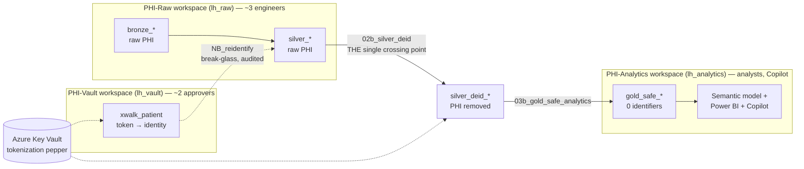

# Architecture & Rationale — the complete picture

> **SYNTHETIC DATA ONLY.** Reference pattern — not a certified de-identification service.
> Read alongside [`security_model.md`](security_model.md), [`enforcement_models.md`](enforcement_models.md),
> and [`hipaa_compliance.md`](hipaa_compliance.md).

This document answers the three questions people ask first, then walks the whole solution end
to end:

1. **Why is de-identification done *first* (before governance/masking)?**
2. **Why doesn't Fabric do this natively — why isn't it "supported"?**
3. **When exactly does de-identification happen, and where?**

---

## 1. The core idea in one sentence

> **Masking hides PHI; de-identification removes it.** This accelerator physically produces a
> PHI-free copy of the data *before* anyone governs, shares, or points AI at it — so the
> protection survives even an administrator, and Copilot can never see a byte of PHI because
> there is no PHI left to see.

Everything below is a consequence of that one design choice.

---

## 2. Why de-identification is done FIRST

De-identification is the **primary** control. Governance (labels, OneLake security, RLS/CLS)
is **secondary** defense-in-depth layered on top. The ordering is deliberate, not arbitrary.

### 2.1 The bypass problem that forces the ordering

Fabric's data-plane access controls — **OneLake security** data-access roles, and **RLS/CLS**
on the SQL endpoint — only restrict *some* callers:

| Workspace role | Bound by OneLake security / RLS / CLS? |
|---|---|
| **Viewer** | **Yes** — scoped to what the data-access role grants |
| **Contributor** | **No — bypasses it** (sees all bytes) |
| **Member** | **No — bypasses it** |
| **Admin** | **No — bypasses it** |

So if PHI physically remains in a table and you rely on masking, then **any Contributor,
Member, or Admin still sees the raw PHI.** CLS is *hide-only* (it hides a column, it doesn't
transform the value), and masking can be bypassed by privileged roles. Governance alone cannot
make a table safe for broad self-service or AI.

**The only control that protects against a privileged caller is removing the bytes.** Once
`gold_safe_*` genuinely contains no identifiers, it doesn't matter who queries it — there is
nothing to leak. That is why de-identification must come *first*: it is the layer that holds
even when every other layer is bypassed.

### 2.2 Why AI / Copilot makes this non-negotiable

Copilot and semantic-model consumers read the **data plane**. Point Copilot at a Gold table
that still carries MRN, name, DOB, and ZIP and it will happily summarize, join, and surface
those identifiers in answers. There is no "mask for Copilot" switch that privileged automation
can't step around. The safe design is to give the AI layer a dataset that is **not PHI by
construction**. De-identification first is what earns the "Copilot-safe" claim.

### 2.3 The layer stack (primary → defense-in-depth)

```
Layer 0  De-identification (bytes removed)      <- PRIMARY. Holds even vs Admin/Member/Contributor.
Layer 1  Workspace RBAC (who can open/run)      <- isolation of the 3 workspaces
Layer 2  OneLake security data-access roles     <- scopes Viewers to specific physical tables
Layer 3  SQL endpoint CLS / RLS                 <- column-hide + row-filter on the SQL/DL path
Layer 4  Purview sensitivity labels             <- classification stamp (NOT access control)
```

Layers 1–4 are real and worth doing, but they are all *hide/restrict* mechanisms. Only Layer 0
*removes*. Build Layer 0 first; the rest is depth.

---

## 3. Why Fabric doesn't do this "natively"

This is the most common misconception, so it is worth being precise. It is **not** a Fabric
gap or a missing feature — it is a *plane* distinction.

### 3.1 The three planes

- **Control plane** — actions *on items*: share, label, classify, manage roles, catalog
  metadata, domains. **Purview** and the **OneLake Catalog** live here. They describe and
  govern data; they never change a value.
- **Data plane** — reading the actual *bytes*: OneLake security data-access roles, RLS, CLS.
  These decide *who can read* a value; they never change it either.
- **De-identification is neither plane.** It is **custom compute that rewrites the bytes** —
  tokenizing an MRN, generalizing a date to a year, truncating a ZIP, suppressing an
  unclassified column. No governance feature transforms data, because transforming data is not
  governance — it is an ETL/compute operation.

> A sensitivity label can *classify* PHI. OneLake security can *restrict who reads* PHI.
> Neither can *remove* PHI. Removing PHI is a compute job — and that is exactly the job this
> accelerator's Spark engine performs.

### 3.2 So what *is* the native part?

Fabric provides all the surrounding machinery — it just doesn't ship an opinionated HIPAA
de-identifier:

| Need | Native Fabric capability | This accelerator adds |
|---|---|---|
| Run the transform at scale | **Spark notebooks over Delta** | The config-driven de-id engine (`fabric_phi_deid`) |
| Keep the secret safe | **Azure Key Vault + managed private endpoint** | `get_pepper()`, min-entropy enforcement, rotation runbook |
| Restrict who reads outputs | **OneLake security, RLS/CLS** | Adapted `sql/rls_cls_policies.sql`, role model |
| Classify / discover | **Purview, OneLake Catalog** | Positioning: label ≠ enforcement |
| Isolate blast radius | **Workspaces + RBAC** | The 3-workspace topology (Raw / Analytics / Vault) |

The accelerator is the **transparent, in-tenant, config-driven reference pattern** that stitches
these native pieces into a provable de-identification pipeline. Nothing leaves Fabric; the
rulebook is reviewable in Git; every run is auditable.

### 3.3 Transform-at-rest vs mask-at-query (why we chose the former)

| | **Model A — Transform-at-rest (this accelerator)** | **Model B — Mask-at-query** |
|---|---|---|
| What | Physically produce a PHI-free copy via Spark | Keep one copy; hide/mask at read time |
| Where PHI lives | Only in Raw/Silver (locked workspace) | Everywhere the table lives; hidden by policy |
| AI / Copilot safety | **Strong** — bytes genuinely are not PHI | Weaker — bypassable by Admin/Member/Contributor; CLS hide-only |
| Referential integrity | Preserved via deterministic tokens | Native (same table) |
| Best for | Analytics + AI + broad self-service | Operational apps needing the real value for *some* roles |

We use **A** as the primary control and layer **B** (`sql/rls_cls_policies.sql`) as
defense-in-depth.

---

## 4. When (and where) de-identification happens

There is exactly **one** privileged crossing point, and exactly **one** governed way back.

### 4.1 The medallion flow and the single crossing point



- **De-identification happens in `02b_silver_deid`** — reading conformed `silver_*` (still raw
  PHI) and writing `silver_deid_*` (PHI removed), driven entirely by `config/deid_rules.yaml`.
  This is *the* moment PHI is transformed. It is the only place `display()`/`show()`/`print()`
  of a raw column is forbidden by hard rule.
- **`03b_gold_safe_analytics`** then builds the PHI-free star schema (`gold_safe_*`) natively in
  the Analytics lakehouse — the AI/BI layer never touches a raw table.
- **Re-identification happens only in `NB_reidentify`** in the isolated Vault workspace — a
  deliberate, audited break-glass action that resolves a `PT-…` token back to an identity via
  the crosswalk. Nobody else has a role in the Vault.

Run order: `01_bronze` → `02_silver_conform` → **`02b_silver_deid`** → `03b_gold_safe_analytics`
→ `NB_scorecard`.

### 4.2 Why "first" also means "as early as the data model allows"

De-id runs at **Silver → Silver-deid**, not at Gold. Doing it early means:

- Raw PHI is confined to Bronze/Silver in the locked **PHI-Raw** workspace. Only ~3 engineers
  ever touch it.
- Everything downstream (Gold, semantic model, reports, Copilot) is built *from the
  de-identified copy*, so no later stage can accidentally re-introduce an identifier.
- The de-id step is a single, reviewable, auditable compliance event rather than a scatter of
  masking rules spread across many consumers.

---

## 5. How de-identification actually works

### 5.1 Deterministic tokenization (keeps joins working)

Identifiers (MRN, NPI, license, DEA) are replaced with a **keyed one-way HMAC-SHA256 token**,
not simply nulled out. Deterministic means the *same* input always yields the *same* token, so
a patient tokenizes identically in every table — **joins still work across the de-identified
star schema**, but the token is irreversible without the secret.

Algorithm (`fabric_phi_deid/tokenization.py`):

```
message = f"{namespace}\x1f{value}".encode("utf-8")          # \x1f = unit separator binds the namespace
token   = "PT-" + hmac.new(pepper, message, sha256).hexdigest()[:16]
```

- `namespace` (e.g. `"mrn"`) prevents cross-domain collisions.
- `pepper` is a high-entropy secret (min 32 chars) — the only thing that makes the token
  reversible via the Vault crosswalk. Rotating it invalidates every token (breach recovery).
- Empty/None values pass through unchanged.

### 5.2 The full strategy matrix

| Safe Harbor concern | Strategy | Reversible? | Referential integrity |
|---|---|---|---|
| MRN / NPI / license / DEA | `tokenize` (HMAC) | Only via Vault crosswalk | Yes (deterministic) |
| Names | `synthesize` | No | Consistent per source |
| Dates (DOB, service) | `generalize(year)` / `date_shift` | No | Intervals preserved (date_shift) |
| ZIP | `generalize(zip3)` — `000` for low-population prefixes | No | Yes |
| Age | `generalize(age_cap=90)` | No | Yes |
| **Anything unclassified** | **`suppress` (deny-by-default)** | N/A | Dropped |

**Deny-by-default** is the safety net: any column *not* named in the rulebook is suppressed, so
a new identifier column can never leak by omission.

### 5.3 What makes it a *production* pattern (not a masking script)

`02b_silver_deid` wraps the transform in compliance controls:

- **Config-driven rulebook**, validated fail-fast before any data is touched.
- **Pre-flight policy audit** vs the live schema (`audit_coverage`) — catches schema drift
  (`missing` rule = hard fail; `defaulted` column = surfaced for review).
- **Row-count parity guard** — de-id is row-preserving; input rows must equal output rows.
- **PHI-free run manifest** (`build_run_manifest`) — who / what / when / which rulebook
  (`config_sha256`); the artifact an auditor asks for.
- **Post-run residual-PHI gate** (`scan_spark_dataframe`) — scans the *output* for
  identifier-shaped values (SSN/phone/email); a clean run scores zero or publish is blocked.
- **Secret hygiene** — pepper from Key Vault, min-entropy enforced, never printed/logged/stored.

---

## 6. The three-workspace topology (blast-radius isolation)

| Workspace | Lakehouse | Holds | Access | Role |
|---|---|---|---|---|
| **PHI-Raw** | `lh_raw` | `bronze_*`, `silver_*` (raw PHI), `silver_deid_*`, de-id notebooks | ~3 engineers | The "before" + the single crossing point |
| **PHI-Analytics** | `lh_analytics` | `gold_safe_*` (PHI-free), semantic model, reports | Analysts, business, Copilot | The "after" — safe consumption |
| **PHI-Vault** | `lh_vault` | `xwalk_*` crosswalk, `NB_reidentify` | ~2 approvers | Governed, audited re-identification |

Only the **de-identified** `gold_safe_*` tables ever cross into PHI-Analytics. `gold_safe_*`
must live *physically* in `lh_analytics` (not as a shortcut) so OneLake security roles can be
authored on them — enforcement of a shortcut defers to the source workspace.

### 6.1 The two users mapped to the three workspaces

| | PHI-Raw | PHI-Analytics | PHI-Vault |
|---|---|---|---|
| **Analyst / Copilot user** | *no access* | **Viewer** + data-access role `analyst_deid` | *no access* |
| **Data steward / break-glass** | Viewer (optional, audit) | Viewer/Member | **Contributor** (must run `NB_reidentify`) |
| Pipeline engineer / admin | Member/Admin | Member | Member |

Key point tying back to §2.1: the analyst is a **Viewer** on PHI-Analytics *because Viewer is
the only role that OneLake security and RLS/CLS can actually restrict*. Never grant the analyst
Contributor — it would bypass every masking layer. Contributor in the Vault is acceptable
*because* the Vault's entire purpose is deliberate, audited re-identification, and no one else
has any role there.

---

## 7. Governance layers 2–4 (defense-in-depth detail)

### 7.1 Layer 2 — OneLake security data-access roles (`lh_analytics`)

- `analyst_deid` — read `gold_safe_*`; scoped by region.
- `data_steward` — read `gold_safe_*` including tokens; all regions.
- Built via the Lakehouse "Manage OneLake data access" UI or the OneLake `dataAccessRoles` REST
  API. Scopes **Viewers**; privileged roles bypass (hence §2.1).

### 7.2 Layer 3 — SQL endpoint CLS / RLS (`sql/rls_cls_policies.sql`)

- **CLS**: `DENY SELECT` on `MRN` (`gold_safe_dim_patient`) and `NPI` (`gold_safe_dim_provider`)
  to `analyst_deid`.
- **RLS**: `sec.fn_region_predicate` on `gold_safe_dim_facility` — steward sees all regions;
  analyst is scoped to their region.
- Adapted for the Lakehouse SQL endpoint (read-only over Delta): region mapping is inline
  `VALUES` in the predicate; roles remain commented until real Entra UPNs are supplied.

### 7.3 Layer 4 — Purview labels & OneLake Catalog

Classification and discovery only. A label is a *stamp*, not an access control; the Catalog
exposes names/metadata (control plane) and leaks **no bytes**. Useful for policy and audit —
never a substitute for removing PHI.

---

## 8. Engineering lessons baked into the notebooks

These are hard-won and worth preserving, because they are the traps that break a Fabric Spark
de-id pipeline in ways that only surface at write time.

### 8.1 Driver vs executor `sys.path` — the `TASK_WRITE_FAILED` trap

A Spark UDF that imports a **workspace-uploaded package** (`fabric_phi_deid`) runs on the
**executor** Python workers, which do **not** inherit the driver's `sys.path`. A bare
row-at-a-time `F.udf` closing over that package fails on the executors with
`ModuleNotFoundError` — surfacing confusingly as **`TASK_WRITE_FAILED`** at `saveAsTable`, not
at import.

Two robust fixes, both used in this accelerator:

- **Ship the package to executors** — `02b_silver_deid` zips `fabric_phi_deid` and calls
  `spark.sparkContext.addPyFile(zip)` so every current and future executor has it. Its internal
  `F.udf` calls are then safe.
- **Vectorized `pandas_udf` over the standard library** — `NB_reidentify` builds its crosswalk
  token with a `pandas_udf` using only stdlib `hmac`/`hashlib`, with the pepper broadcast **by
  value**. No package import on the executor at all — fastest and most robust.

### 8.2 Robust package path detection

The uploaded folder may land under `Files/accelerator/` *or* `Files/accelerator/src/`. Both
notebooks auto-detect which parent actually contains `fabric_phi_deid/`, derive `sys.path`, the
executor zip root, and the config path from the detected location, and fail fast with an
actionable message otherwise — so a mismatched upload can't silently ship an empty zip and
trigger `TASK_WRITE_FAILED`.

### 8.3 Parity guard on tokenization

`NB_reidentify` asserts its distributed (`pandas_udf`) token equals the reference
`fabric_phi_deid.tokenize(...)` output. If the two ever diverged, the crosswalk wouldn't
reverse — so the guard fails the run rather than silently producing an unusable vault.

---

## 9. TL;DR

- **De-id first** because it is the only control that survives a privileged (Admin/Member/
  Contributor) caller and the only way to make data genuinely Copilot-safe. Governance
  hides/restricts; de-id *removes*.
- **Not "unsupported" by Fabric** — transforming bytes is compute, not governance. Fabric
  natively provides the Spark, Key Vault, OneLake security, RLS/CLS, and Purview; this
  accelerator supplies the opinionated de-id engine that stitches them together.
- **When/where:** exactly once, in `02b_silver_deid` (Silver → Silver-deid), early in the
  medallion, in the locked PHI-Raw workspace; the only path back is the audited `NB_reidentify`
  in the isolated Vault.
```
