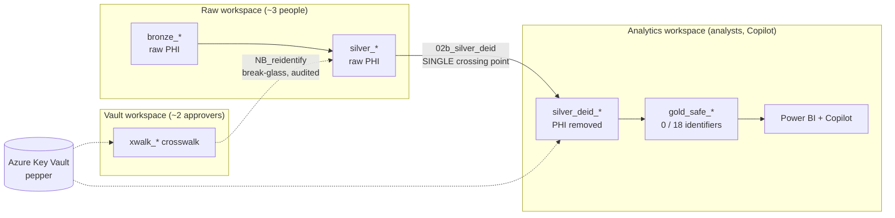

# Enforcement Models: where Purview stops and de-identification begins

> **SYNTHETIC DATA ONLY** (accelerator).

## Two ways to keep PHI away from consumers

| | **Model A — Transform-at-rest (this accelerator)** | **Model B — Mask-at-query** |
|---|---|---|
| **What** | Physically produce a PHI-free copy (`gold_safe_*`) via Spark | Keep one copy; hide/mask columns/rows at read time (RLS/CLS/dynamic masking) |
| **Where PHI lives** | Only in Raw/Silver (locked-down workspace) | Everywhere the table lives; hidden by policy |
| **AI / Copilot safety** | Strong — the bytes are genuinely not PHI | Weaker — masking can be bypassed by admins/Member/Contributor; CLS is hide-only |
| **Referential integrity** | Preserved via deterministic tokens | Native (same table) |
| **Best for** | Analytics + AI + broad self-service on de-identified data | Operational apps that need the real value for *some* roles |
| **Fabric feature** | Notebooks (Spark) + Key Vault | OneLake security, Warehouse RLS/CLS |

The accelerator uses **A** as the primary control and layers **B** ([`sql/rls_cls_policies.sql`](../sql/rls_cls_policies.sql))
as defense-in-depth. A is what makes the Gold layer safe for Copilot: masking merely *hides*
PHI, while de-identification *removes* it.

## The plane distinction (why this matters)

- **Control plane** = actions on items (share, label, classify, manage roles, domains,
  catalog metadata). Purview and the OneLake Catalog operate here.
- **Data plane** = reading the actual bytes. OneLake security (data-access roles / RLS / CLS)
  operates here.
- **De-identification is neither plane** — it is **custom compute** that *changes the bytes*.
  That's exactly why nothing native in Fabric does it for you, and why this engine exists.

> **A sensitivity label does not de-identify.** Purview can *classify, label, and monitor*
> PHI; it cannot *transform* it. OneLake security can *restrict who reads* PHI; it cannot
> *remove* it. Removing PHI is the missing layer this accelerator provides.

## PHI travel through the medallion

- The **only** place raw PHI becomes de-identified is `02b_silver_deid` — the single
  privileged crossing point.
- The **only** place a token becomes an identity again is the Vault crosswalk via
  `NB_reidentify` — audited, ~2 people.
- The **pepper** never appears in code, tables, notebook output, or Git.

## Strategy → engine matrix

| Safe Harbor concern | Strategy | Reversible? | Referential integrity |
|---------------------|----------|-------------|-----------------------|
| MRN / NPI / license / DEA | `tokenize` (HMAC) | Only via Vault crosswalk | Yes (deterministic) |
| Names | `synthesize` | No | Consistent per source |
| Dates (DOB, service) | `generalize(year)` / `date_shift` | No | Intervals preserved (date_shift) |
| ZIP | `generalize(zip3)` | No | Yes |
| Age | `generalize(age_cap=90)` | No | Yes |
| Anything unclassified | `suppress` (deny-by-default) | N/A | Dropped |
