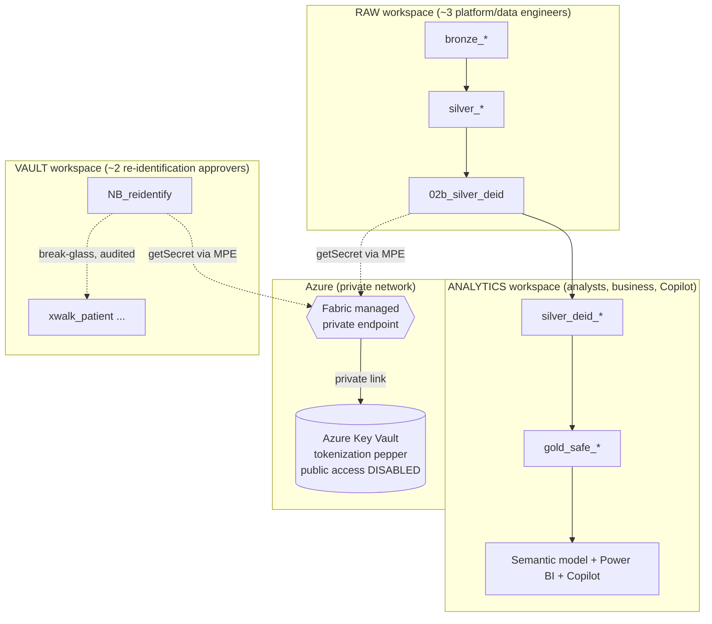

# Security Model

> **SYNTHETIC DATA ONLY** (accelerator).

## Three-workspace isolation

**How the pepper is reached (Option 1 — target architecture).** The Key Vault has
**public network access disabled**; it is *only* reachable over a **Fabric managed private
endpoint (MPE)**. An MPE is a private network interface that Fabric provisions inside its
own managed virtual network and connects to your vault over the Azure backbone via **Azure
Private Link** — traffic never traverses the public internet. You create the MPE in the
Fabric workspace, then **approve** the pending connection on the Key Vault side; from then on
`notebookutils.credentials.getSecret(...)` resolves the pepper privately. This is the
least-privilege, no-public-surface posture expected for PHI and is enforced by managed-tenant
policy (public Key Vaults are blocked by design).

> **Demo mode (Option 2 fallback).** Managed private endpoints require an **F-SKU Fabric
> capacity**. When running this accelerator on synthetic data without that capacity, the
> notebook instead reads the pepper from the `PHI_DEID_PEPPER` environment variable
> (`get_pepper()` supports both paths). The **architecture above is the production target**;
> the env-var path is a demo convenience only and is never used with real PHI.

| Workspace | Holds | Access | Purpose |
|-----------|-------|--------|---------|
| **Raw** | `bronze_*`, `silver_*` (raw PHI), de-id notebooks | ~3 engineers | Ingest + the single de-id crossing point |
| **Analytics** | `silver_deid_*`, `gold_safe_*`, model, reports | Analysts, business, Copilot | Consumption of PHI-free data |
| **Vault** | `xwalk_*` crosswalk, `NB_reidentify` | ~2 approvers | Governed, audited re-identification |

## The pepper (tokenization secret)

- **Production:** stored in **Azure Key Vault** (public access disabled), fetched at runtime
  via `notebookutils.credentials.getSecret` **over a Fabric managed private endpoint** (Option 1).
- **Demo/synthetic:** read from the `PHI_DEID_PEPPER` environment variable (Option 2) when no
  F-SKU capacity / MPE is available. `get_pepper()` supports both; the length check still applies.
- **Never** in code, notebook output, tables, logs, or Git.
- **Rotation = breach recovery**: rotating the pepper invalidates all tokens; re-run `02b`
  (and rebuild the Vault crosswalk) to re-tokenize everything.

## Leak vectors and how they're closed

| Vector | Risk | Control |
|--------|------|---------|
| `display()` / `.show()` of raw df in the de-id notebook | Raw PHI in notebook output/snapshots | HARD RULE + lint check in `tests/` (no display/show/print/collect/toPandas of raw) |
| `print(PEPPER)` | Secret in output/logs | Only `bool(PEPPER)` is ever printed |
| Spark logs echoing rows | PHI in cluster logs | Avoid `.collect()`/`.toPandas()` on raw; process via DataFrame ops/UDFs |
| Crosswalk copied out of Vault | Re-identification everywhere | Crosswalk exists only in Vault workspace; OneLake security + audit |
| Admin/Member bypass of masking | Masking ≠ removal | Primary control is de-identification (bytes removed), not masking |

## Data-plane enforcement

- **OneLake security** data-access roles decide who reads which tables/folders (full CRUD on
  roles via the OneLake Data Access Security REST API).
- **RLS/CLS** ([`sql/rls_cls_policies.sql`](../sql/rls_cls_policies.sql)) add row/column
  scoping at the SQL endpoint as defense-in-depth.
- Remember: **Admin/Member/Contributor can bypass** data-plane masking, and **CLS is
  hide-only** — which is why de-identification (Model A) is the primary control, not masking.
